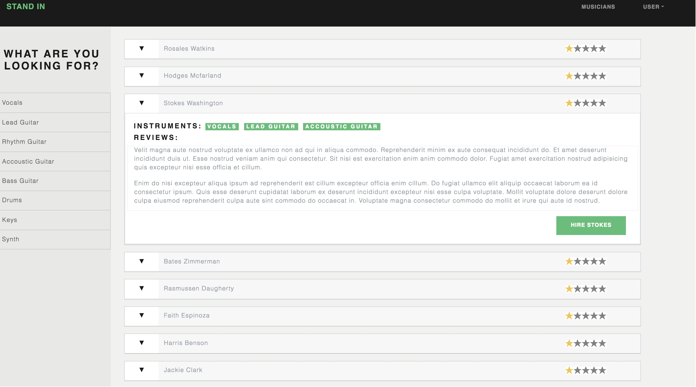

## Stand-in reactApp.

Stand-in is a dynamic react/redux application used to contract and rate musicians.

### Technologies used:
* HTML
* CSS
* React/Redux
* Javascript
* Node/express
* postgreSQL
* Sessions/Cookies

